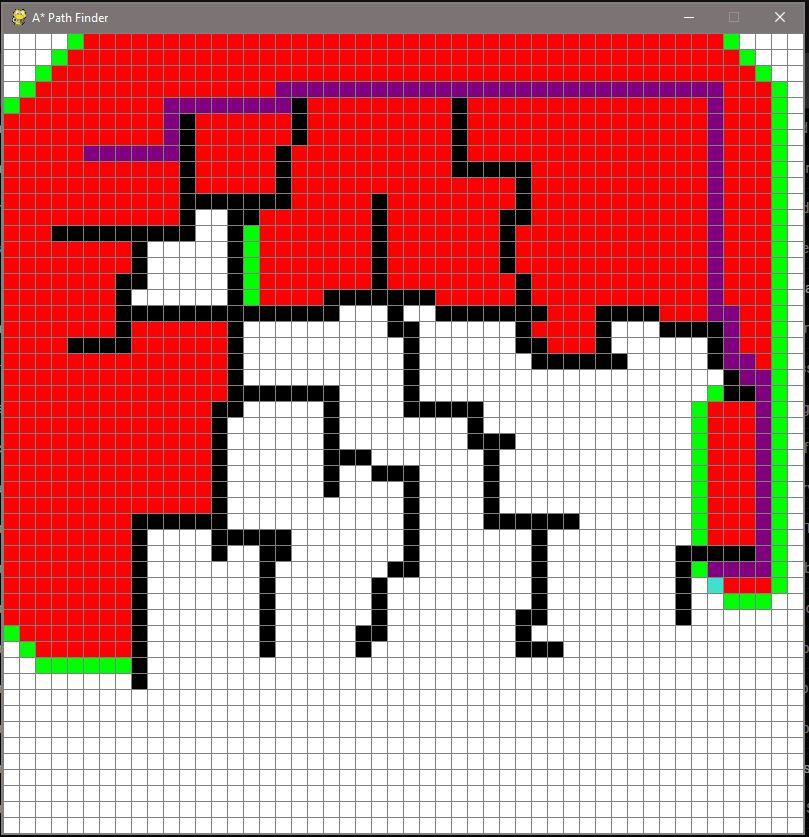

# A* Path-Finding Visualizer
A path-finding visualizer built with Python using the pygame module to display the output.
The visualizer uses the A* Algorithm to traverse the graph and find the opposite node.

---

---

This particular implementation uses unweighted edges and the informed search stratagey to weave
in and out of barricades and find the opposite node. The use of an OOP approach creates classes and
segments large parts of the code for the sake of modularity.

In order to begin using the program, pip install pygame and download the code from the repo.
Use the mouse to click any 2 grid-squares on the graph and hit the spacebar to see the visualization.
Hit "c" to clear the screen at any time and restart. 
I have commented out alot of the code in efforts of explaining whats going on.
